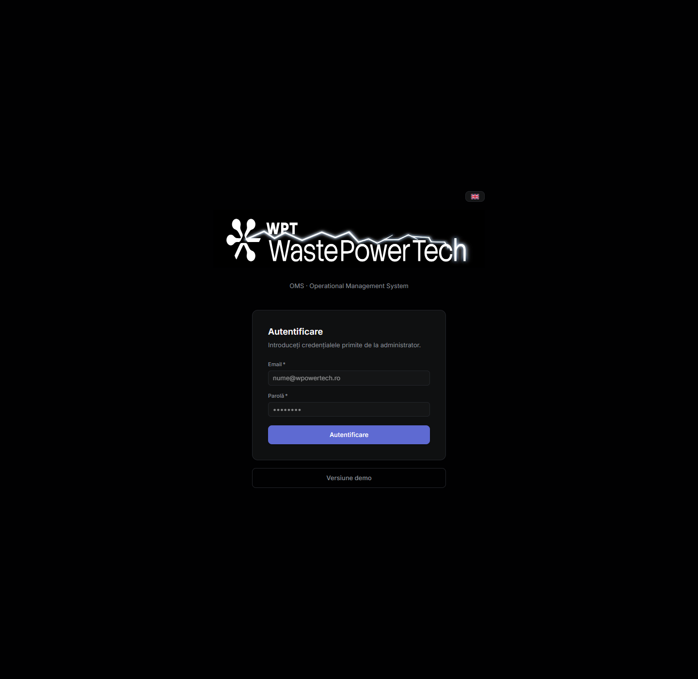
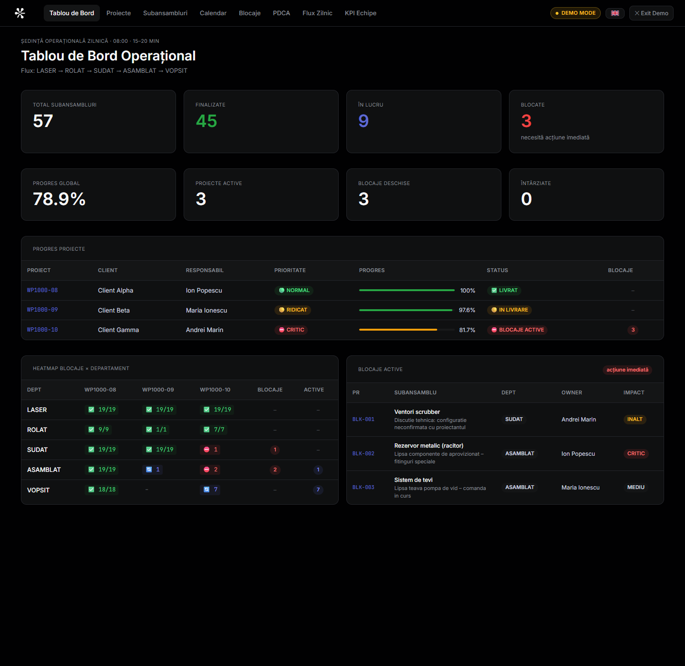
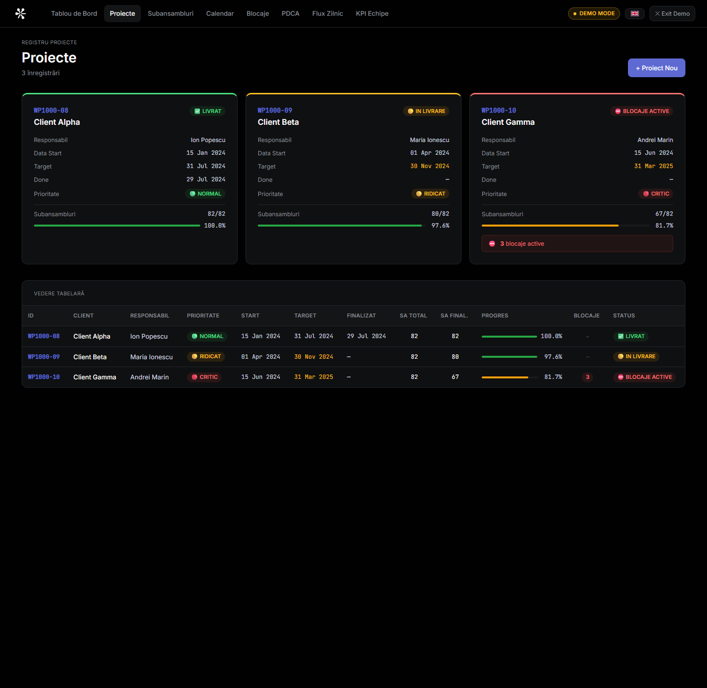
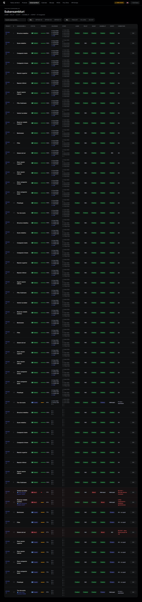
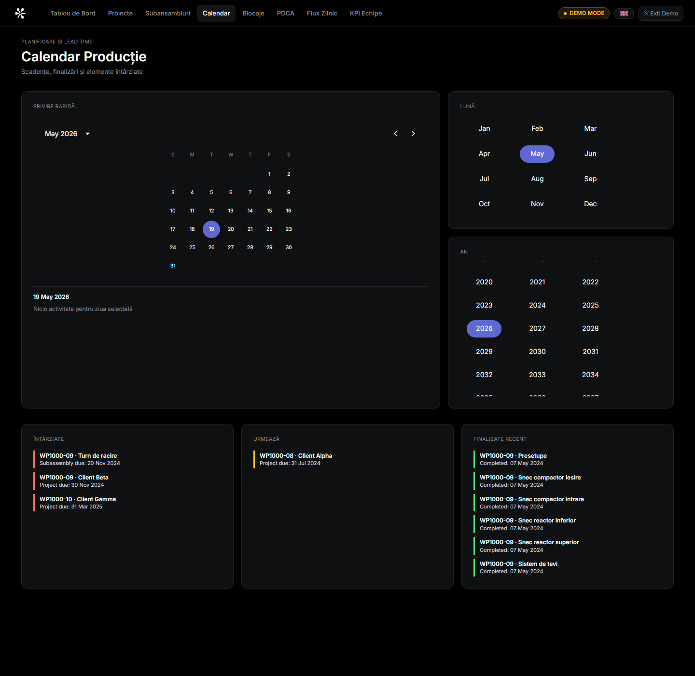
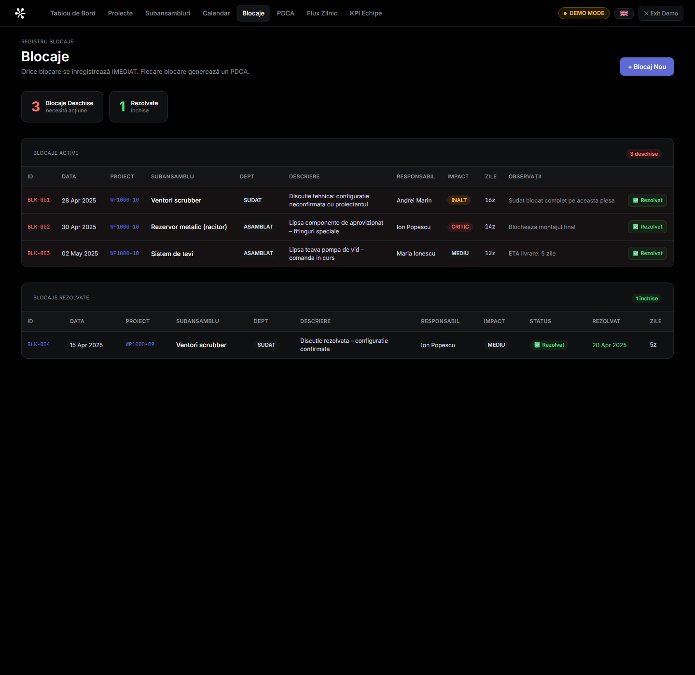

# Waste Powertech OMS - Ghid de Utilizare

Acest ghid explica pe scurt cum folosesti aplicatia in fiecare zi, ce actualizezi in fiecare ecran si unde vezi rapid daca un proiect intarzie.

Toate capturile din acest document sunt facute in `Demo Mode`.

---

## 1. Intrare in aplicatie

La deschidere ai doua variante:

1. Te autentifici cu emailul si parola primite de la administrator.
2. Apesi `Versiune demo` daca vrei sa vezi aplicatia fara cont.

---

## 2. Ce face sistemul

Waste Powertech OMS este board-ul digital pentru productie. Aplicatia te ajuta sa:

- vezi starea fiecarui proiect
- urmaresti fiecare subansamblu pe fluxul `LASER -> ROLAT -> SUDAT -> ASAMBLAT -> VOPSIT`
- inregistrezi blocaje si actiuni PDCA
- vezi termenele limita si finalizarile in calendar
- masori mai clar cat dureaza asamblarea

---

## 3. Harta rapida a aplicatiei

In bara de sus gasesti aceste ecrane:

| Ecran | La ce il folosesti |
|---|---|
| `Tablou de Bord` | vezi situatia generala in 30-60 secunde |
| `Proiecte` | creezi proiecte si vezi datele mari de livrare |
| `Subansambluri` | actualizezi progresul real al fiecarui SA |
| `Calendar` | vezi ce este due, ce e intarziat, ce s-a terminat |
| `Blocaje` | loghezi problemele care opresc sau incetinesc lucrul |
| `PDCA` | urmaresti actiunile corective |
| `Flux Zilnic` | inregistrezi miscarea SA-urilor intre departamente |
| `KPI Echipe` | urmaresti eficienta, calitatea si lead time-ul |

---

## 4. Tablou de Bord

Acesta este ecranul pe care merita sa il deschizi primul in fiecare dimineata.

Ce vezi aici:

- numarul total de subansambluri
- cate sunt finalizate, in lucru sau blocate
- progresul pe proiect
- blocajele active
- heatmap-ul pe departamente

Cum il folosesti:

1. Verifica daca exista proiecte cu progres mic sau cu blocaje active.
2. Verifica departamentele unde apar blocaje repetate.
3. Intra apoi in `Subansambluri`, `Blocaje` sau `Calendar` pentru actiune.

---

## 5. Proiecte

In `Proiecte` creezi proiectele noi si urmaresti datele mari:

- `Data Start`
- `Data Target`
- `Data Finalizare`
- responsabilul
- prioritatea
- numarul total de subansambluri

Important:

- cand creezi un proiect nou, cele 19 subansambluri standard se adauga automat
- `Data Target` este termenul proiectului
- `Data Finalizare` se completeaza cand proiectul este inchis efectiv

Cum lucrezi aici:

1. Apasa `+ Proiect Nou`.
2. Completeaza ID-ul proiectului, clientul si responsabilul.
3. Seteaza datele principale.
4. Salveaza proiectul.

---

## 6. Subansambluri

Acesta este ecranul operational principal.

Aici poti:

- filtra dupa proiect
- cauta rapid un subansamblu
- schimba `Status Global`
- actualiza `Progres`
- completa `Start`, `Due`, `Done`
- completa datele de finalizare pe fiecare etapa:
  `Laser Done`, `Rolat Done`, `Sudat Done`, `Asamblat Done`, `Vopsit Done`

Cum il folosesti corect:

1. Intra pe proiectul tau.
2. Gaseste subansamblul.
3. Apasa `Edit`.
4. Actualizeaza statusul real si progresul real.
5. Completeaza datele daca etapa a inceput, are termen sau s-a terminat.
6. Salveaza.

Recomandare simpla:

- completeaza `Due` cand stii pana cand trebuie terminat SA-ul
- completeaza `Done` imediat cand SA-ul este gata
- completeaza campurile `... Done` pe departamente ca sa poti masura viteza reala pe flux

---

## 7. Calendar

Acesta este ecranul nou pentru planificare si lead time.

Aici vezi:

- ce este `overdue`
- ce urmeaza sa ajunga la termen
- ce s-a finalizat recent
- o vedere lunara cu datele importante

Cand il folosesti:

1. La inceputul zilei pentru prioritizare.
2. In sedinta operativa pentru a vedea ce intarzie.
3. Cand vrei sa compari termenele promise cu termenele reale.

Ce inseamna pe scurt:

- `Overdue` = trebuia terminat si nu este marcat ca gata
- `Upcoming` = urmeaza sa ajunga la termen
- `Recently completed` = s-a terminat recent si poti verifica viteza de executie

---

## 8. Blocaje

In `Blocaje` inregistrezi imediat orice problema care opreste sau risca sa intarzie productia.

Cand adaugi un blocaj:

1. Apasa `+ Blocaj Nou`.
2. Completeaza:
   `ID`, `Data Deschidere`, `Proiect`, `Subansamblu`, `Departament`, `Responsabil`, `Impact`.
3. Scrie clar problema in `Descriere Blocaj`.
4. Salveaza.

Cand il rezolvi:

1. Apasa `Rezolvat`.
2. Sistemul trece blocajul in lista de rezolvate.

Regula buna:

- daca blocajul exista in realitate, el trebuie sa existe si in sistem

---

## 9. PDCA

In `PDCA` urmaresti actiunile de corectie si prevenire.

Foloseste acest ecran cand:

- un blocaj necesita actiune clara si responsabil
- exista o problema recurenta
- vrei termen si urmarire pana la inchidere

Flux simplu:

1. Creezi actiunea PDCA.
2. Setezi responsabilul si termenul.
3. Urmaresti statusul.
4. Inchizi actiunea cand a fost rezolvata.

---

## 10. Flux Zilnic

In `Flux Zilnic` notezi miscarea unui subansamblu intre departamente.

Exemple:

- `LASER -> ROLAT`
- `SUDAT -> ASAMBLAT`
- `ASAMBLAT -> VOPSIT`

Completeaza acest ecran cand un SA este predat mai departe in flux.

Campuri utile:

- data
- proiect
- subansamblu
- departament sursa
- departament destinatie
- echipa
- validat de

---

## 11. KPI Echipe

In `KPI Echipe` urmaresti performanta saptamanala.

Aici completezi:

- SA intrare
- SA iesire
- SA blocate
- SA intarziate
- eficienta
- lead time
- calitate

Foloseste acest ecran mai ales la review-ul saptamanal.

---

## 12. Rutina recomandata de lucru

### Zilnic

1. Deschide `Tablou de Bord`.
2. Verifica `Calendar` pentru overdue si due.
3. Intra in `Subansambluri` si actualizeaza statusul real.
4. Daca exista probleme, logheaza-le in `Blocaje`.
5. Daca SA-ul se muta intre departamente, actualizeaza `Flux Zilnic`.
6. Daca exista actiuni deschise, verifica `PDCA`.

### Saptamanal

1. Verifica `KPI Echipe`.
2. Uita-te la proiectele cu multe intarzieri.
3. Compara `Data Target` cu `Data Finalizare`.
4. Analizeaza unde apar cele mai multe intarzieri pe etape.

---

## 13. Cum masori viteza de asamblare

Pentru ca acesta este unul dintre scopurile principale ale aplicatiei, completeaza datele consecvent:

- `Data Start` la proiect si la subansamblu
- `Data Target` sau `Due` cand exista termen clar
- `Data Finalizare` sau `Done` cand lucrarea este terminata
- `Laser Done`, `Rolat Done`, `Sudat Done`, `Asamblat Done`, `Vopsit Done` cand fiecare etapa se incheie

Daca aceste campuri sunt actualizate corect, poti vedea:

- cat a durat un SA cap-coada
- unde a stat cel mai mult
- ce proiecte intra in intarziere
- ce departament incetineste fluxul

---

## 14. Demo Mode

`Demo Mode` este util pentru:

- training intern
- prezentari
- verificare UI
- testare rapida fara login

Cand vrei sa iesi, apasa `Exit Demo`.

---

## 15. Probleme frecvente

### Nu vad tab-ul Admin

Contul tau nu are rol de admin.

### Nu apar date noi in calendar

Verifica daca ai completat campurile de data in `Proiecte` sau `Subansambluri`.

### Un SA pare terminat, dar apare overdue

Completeaza si `Done`, nu doar statusul textual.

### Nu vad subansamblurile dupa creare proiect

La proiectele noi ele se adauga automat. Daca nu apar, da refresh si verifica daca proiectul s-a salvat corect.

---

## 16. Regula de aur

Aplicatia este buna doar daca reflecta realitatea din productie in aceeasi zi.

Pe scurt:

- status real
- date reale
- blocaje reale
- predari reale

Daca actualizezi aceste 4 lucruri constant, aplicatia devine utila pentru planificare, prioritizare si masurarea vitezei reale de asamblare.
